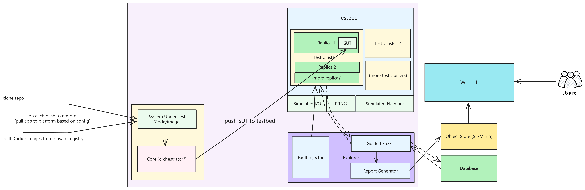

# Architecture

This is the current proposed design for Openthesis:

## Components

### Core

This is the core app, whose responsibility is to:

- handle user interactions
- manage/initiate tests inside the VM
- pull code from a repository and pass it to the VM

### Testbed

This is the area where miniature VMs are spun up with the SUT (system under test) placed inside it by the core app.

### Explorer

The "explorer" is comprised of a guided fuzzer which helps in finding interesting execution paths and possibly prune/reduce the state space needed to search. It collects information throughout the session and passes it on to the postproc (report generator).